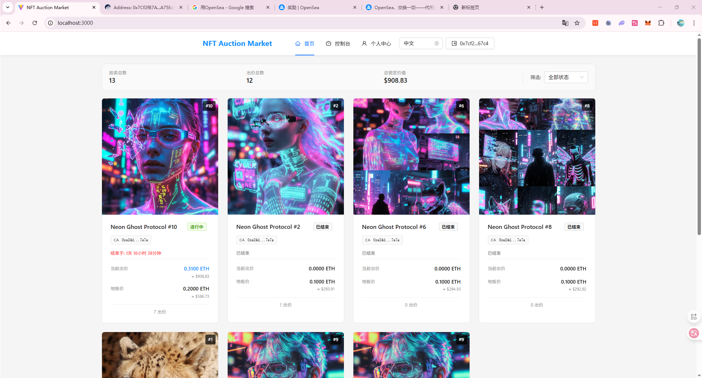
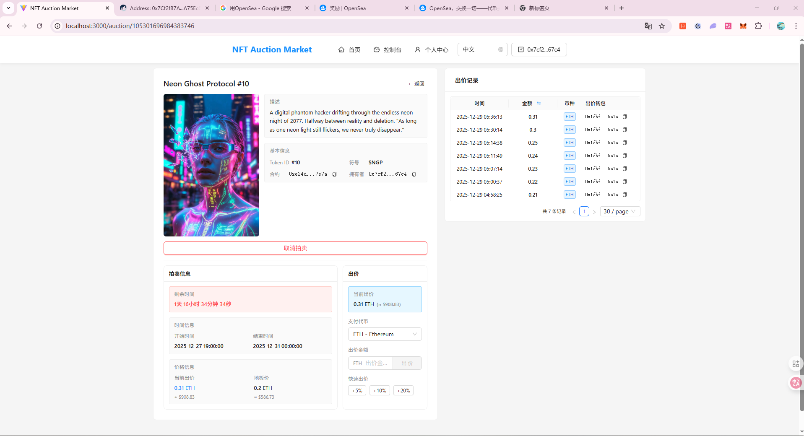
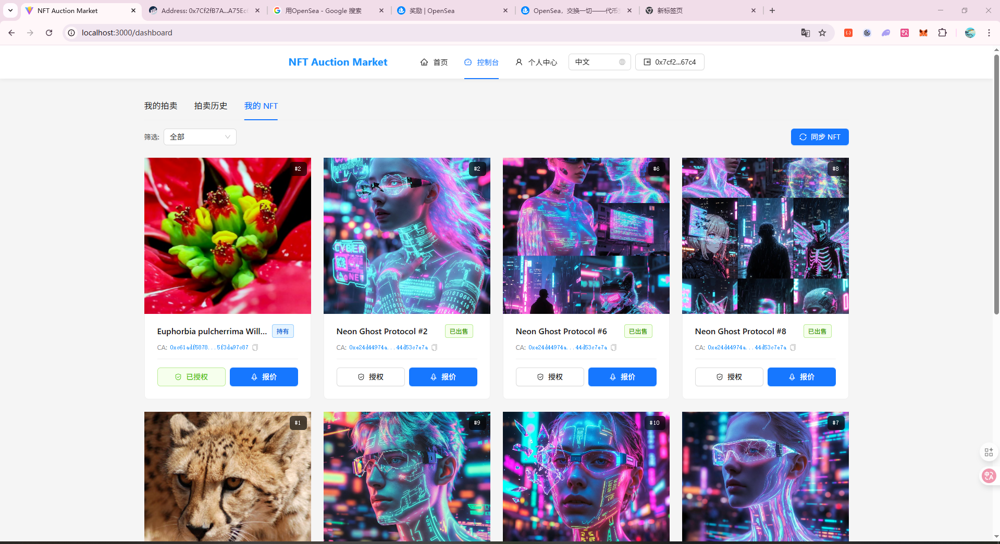
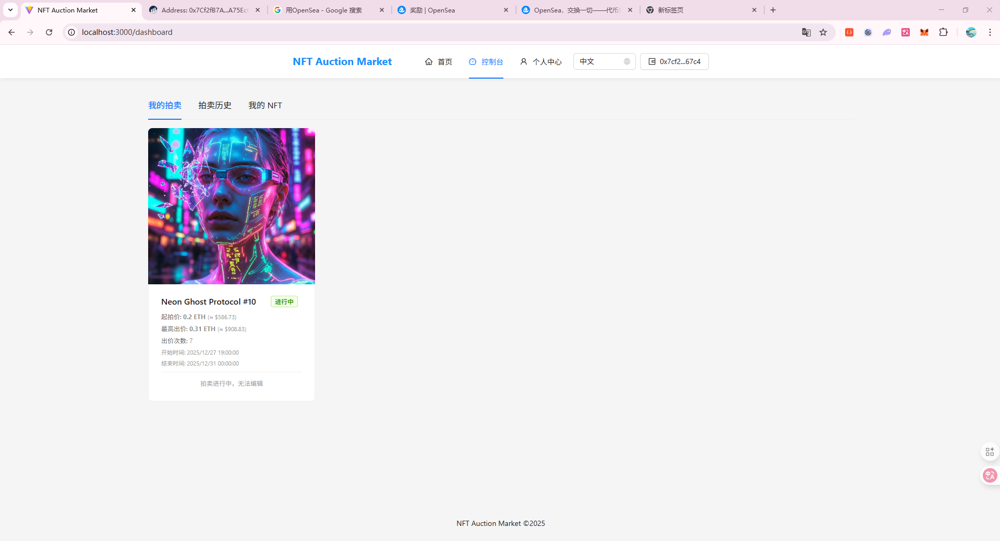
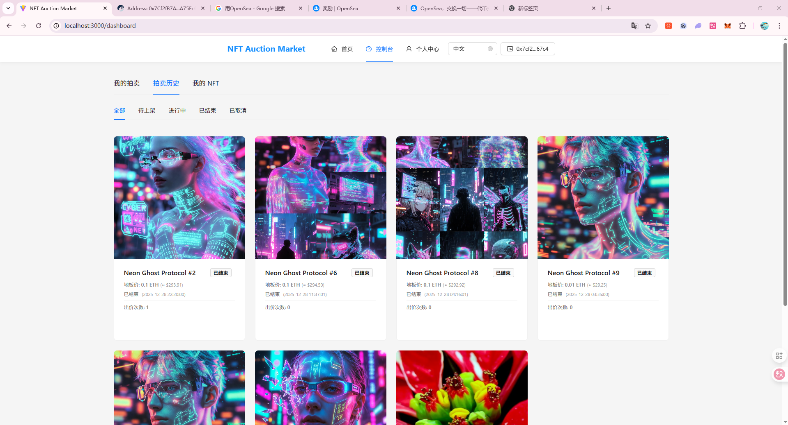

# NFT 拍卖商城项目总结文档

## 📋 项目概述

NFT 拍卖商城是一个基于区块链的去中心化 NFT 拍卖平台，由前端应用和后端 API 服务组成。平台支持用户通过 MetaMask 钱包连接，进行 NFT 拍卖和出价，所有交易都在链上执行，确保透明和不可篡改。

### 核心特性

- 🔐 **钱包登录认证**：基于 MetaMask 的钱包签名登录
- 🎨 **NFT 拍卖管理**：创建、查询、更新、取消 NFT 拍卖
- 💰 **链上出价**：直接在区块链上进行出价交易
- 📊 **实时数据同步**：WebSocket 实时推送拍卖状态和出价更新
- 🌐 **多链支持**：支持以太坊主网和测试网（Sepolia）
- 📱 **响应式设计**：适配桌面端和移动端
- 🌍 **国际化支持**：支持中英文切换

### 界面预览

#### 首页


#### 拍卖详情


#### 我的 NFT


#### 创建拍卖


#### 拍卖历史


---

## 🏗️ 技术架构

### 系统架构图

```
┌─────────────────┐         ┌──────────────────┐         ┌─────────────────┐
│   Frontend      │         │   Backend API    │         │   Blockchain    │
│   (React)       │◄───────►│   (Go/Gin)       │◄───────►│   (Ethereum)    │
│                 │  HTTP   │                  │  RPC    │                 │
│  - React 18     │         │  - Gin Framework │         │  - Smart        │
│  - TypeScript   │         │  - GORM          │         │    Contracts    │
│  - Vite         │         │  - MySQL         │         │  - Web3.js      │
│  - ethers.js    │         │  - Redis         │         │                 │
└─────────────────┘         └──────────────────┘         └─────────────────┘
       │                            │
       │                            │
       └──────── WebSocket ─────────┘
              (实时推送)
```

### 技术栈

#### 前端技术栈
- **框架**: React 18 + TypeScript
- **构建工具**: Vite 5
- **路由**: React Router v6
- **状态管理**: Zustand
- **UI 组件**: Ant Design 5
- **数据获取**: React Query (TanStack Query)
- **Web3 交互**: ethers.js v6
- **国际化**: react-i18next
- **样式**: CSS Modules + Ant Design

#### 后端技术栈
- **语言**: Go 1.25
- **Web 框架**: Gin
- **ORM**: GORM
- **数据库**: MySQL 8.0+
- **缓存**: Redis
- **任务队列**: Asynq (基于 Redis)
- **以太坊客户端**: go-ethereum (ethclient)
- **认证**: JWT
- **日志**: zerolog
- **配置**: YAML
- **API 文档**: Swagger

#### 基础设施
- **区块链**: Ethereum (Sepolia Testnet / Mainnet)
- **钱包**: MetaMask
- **WebSocket**: Gorilla WebSocket
- **数据库连接池**: GORM Connection Pool

---

## 📁 项目结构

### 后端项目结构 (my-auction-market-api)

```
my-auction-market-api/
├── cmd/
│   └── server/
│       └── main.go                 # 应用入口点
│
├── internal/                       # 内部代码包
│   ├── config/                     # 配置管理
│   │   └── config.go               # 配置文件加载和解析
│   │
│   ├── database/                   # 数据库相关
│   │   ├── database.go             # 数据库连接初始化
│   │   └── gorm_logger.go          # GORM 日志适配器
│   │
│   ├── handlers/                   # HTTP 处理器
│   │   ├── auction_handler.go      # 拍卖相关接口
│   │   ├── bid_handler.go          # 出价相关接口
│   │   ├── user_handler.go         # 用户相关接口
│   │   ├── nft_handler.go          # NFT 相关接口
│   │   ├── auction_task_handler.go # 拍卖任务接口
│   │   ├── config_handler.go       # 配置接口
│   │   └── health_handler.go       # 健康检查
│   │
│   ├── middleware/                 # 中间件
│   │   ├── auth.go                 # JWT 认证中间件
│   │   ├── request_logger.go       # 请求日志
│   │   └── validation.go           # 请求验证
│   │
│   ├── models/                     # 数据模型
│   │   ├── user.go                 # 用户模型
│   │   ├── auction.go              # 拍卖模型
│   │   ├── nft.go                  # NFT 模型
│   │   └── nft_ownership.go        # NFT 所有权模型
│   │
│   ├── services/                   # 业务逻辑层
│   │   ├── manager.go              # 服务管理器
│   │   ├── user_service.go         # 用户服务
│   │   ├── auction_service.go      # 拍卖服务
│   │   ├── bid_service.go          # 出价服务
│   │   ├── nft_service.go          # NFT 服务
│   │   ├── auction_task_scheduler.go # 拍卖任务调度器
│   │   └── listener_service.go     # 区块链事件监听服务
│   │
│   ├── ethereum/                   # 以太坊相关
│   │   ├── client.go               # 以太坊客户端封装
│   │   └── etherscan.go            # Etherscan API 客户端
│   │
│   ├── contracts/                  # 智能合约相关
│   │   ├── my_auction/             # 拍卖合约
│   │   ├── erc721_nft/             # ERC721 NFT 合约
│   │   └── erc20_metadata/         # ERC20 代币合约
│   │
│   ├── router/                     # 路由配置
│   │   └── router.go               # 路由注册
│   │
│   ├── websocket/                  # WebSocket 服务
│   │   ├── hub.go                  # WebSocket Hub
│   │   ├── handler.go              # WebSocket 处理器
│   │   └── message.go              # 消息定义
│   │
│   ├── jwt/                        # JWT 认证
│   │   └── jwt.go                  # JWT 生成和验证
│   │
│   ├── logger/                     # 日志工具
│   │   └── logger.go               # 日志初始化
│   │
│   ├── response/                   # 响应格式
│   │   └── response.go             # 统一响应格式
│   │
│   ├── page/                       # 分页工具
│   │   └── pagination.go           # 分页处理
│   │
│   ├── utils/                      # 工具函数
│   │   ├── ethereum.go             # 以太坊工具
│   │   └── signature.go            # 签名验证
│   │
│   └── validator/                  # 验证器
│       └── validator.go            # 请求验证
│
├── sql/                            # SQL 脚本
│   └── db.sql                      # 数据库初始化脚本
│
├── docs/                           # 文档
│   ├── swagger.json                # Swagger API 文档
│   ├── swagger.yaml                # Swagger YAML 格式
│   ├── AMOUNT_STORAGE_DESIGN.md    # 金额存储设计文档
│   └── AUCTION_TASK_SCHEDULER.md   # 拍卖任务调度器文档
│
├── config.yaml.example             # 配置文件模板
├── config.yaml                     # 配置文件（本地，不提交）
├── go.mod                          # Go 模块定义
├── go.sum                          # Go 依赖锁定
└── README.md                       # 项目说明
```

### 前端项目结构 (my-auction-market-front)

```
my-auction-market-front/
├── public/                         # 静态资源
│   └── vite.svg                    # 图标
│
├── src/
│   ├── components/                 # 组件
│   │   ├── Common/                 # 通用组件
│   │   │   ├── Empty.tsx           # 空状态组件
│   │   │   ├── Loading.tsx         # 加载组件
│   │   │   ├── LanguageSwitcher.tsx # 语言切换
│   │   │   └── TextWithTooltip.tsx  # 文本提示
│   │   │
│   │   ├── Layout/                 # 布局组件
│   │   │   ├── Header.tsx          # 页面头部
│   │   │   └── Header.css          # 头部样式
│   │   │
│   │   ├── NFT/                    # NFT 组件
│   │   │   ├── NFTCard.tsx         # NFT 卡片
│   │   │   └── NFTCard.css         # 卡片样式
│   │   │
│   │   └── Wallet/                 # 钱包组件
│   │       ├── ConnectWallet.tsx   # 连接钱包
│   │       ├── WalletInfo.tsx      # 钱包信息
│   │       └── NetworkStatus.tsx   # 网络状态
│   │
│   ├── pages/                      # 页面
│   │   ├── Home/                   # 首页
│   │   │   ├── index.tsx           # 首页组件
│   │   │   └── Home.css            # 首页样式
│   │   │
│   │   ├── Dashboard/              # 仪表板
│   │   │   ├── index.tsx           # Dashboard 主组件
│   │   │   ├── Dashboard.css       # 样式
│   │   │   ├── MyNFTs.tsx          # 我的 NFT
│   │   │   ├── CreateAuction.tsx   # 创建拍卖
│   │   │   ├── MyAuctions.tsx      # 我的拍卖
│   │   │   └── AuctionHistory.tsx  # 拍卖历史
│   │   │
│   │   ├── Profile/                # 个人资料
│   │   │   ├── index.tsx           # 资料页
│   │   │   └── Profile.css         # 样式
│   │   │
│   │   └── AuctionDetail/          # 拍卖详情
│   │       ├── index.tsx           # 详情页
│   │       └── AuctionDetail.css   # 样式
│   │
│   ├── services/                   # 服务层
│   │   ├── api.ts                  # REST API 服务
│   │   ├── contract.ts             # 智能合约交互
│   │   ├── websocket.ts            # WebSocket 服务
│   │   └── mockData.ts             # 模拟数据（开发用）
│   │
│   ├── store/                      # 状态管理
│   │   ├── walletStore.ts          # 钱包状态
│   │   └── tokenStore.ts           # 代币状态
│   │
│   ├── hooks/                      # 自定义 Hooks
│   │   ├── useNetwork.ts           # 网络状态 Hook
│   │   └── useWebSocket.ts         # WebSocket Hook
│   │
│   ├── config/                     # 配置
│   │   └── contract.ts             # 合约配置（从 API 动态加载）
│   │
│   ├── types/                      # TypeScript 类型定义
│   │   ├── index.ts                # 通用类型
│   │   ├── auction.ts              # 拍卖类型
│   │   ├── nft.ts                  # NFT 类型
│   │   ├── user.ts                 # 用户类型
│   │   └── ethereum.d.ts           # 以太坊类型扩展
│   │
│   ├── utils/                      # 工具函数
│   │   ├── constants.ts            # 常量定义
│   │   ├── format.ts               # 格式化工具
│   │   └── placeholder.ts          # 占位符工具
│   │
│   ├── i18n/                       # 国际化
│   │   ├── index.ts                # i18n 配置
│   │   └── locales/                # 语言包
│   │       ├── zh-CN.ts            # 中文
│   │       └── en-US.ts            # 英文
│   │
│   ├── abis/                       # 合约 ABI
│   │   └── MyXAuctionV2.json       # 拍卖合约 ABI
│   │
│   ├── App.tsx                     # 根组件
│   ├── App.css                     # 根样式
│   ├── main.tsx                    # 应用入口
│   ├── index.css                   # 全局样式
│   ├── router.tsx                  # 路由配置
│   └── vite-env.d.ts               # Vite 类型定义
│
├── .env.example                    # 环境变量模板（如果有）
├── .env                            # 环境变量（本地，不提交）
├── vite.config.ts                  # Vite 配置
├── tsconfig.json                   # TypeScript 配置
├── tsconfig.node.json              # Node TypeScript 配置
├── package.json                    # 项目配置和依赖
├── package-lock.json               # 依赖锁定
├── README.md                       # 项目说明
├── PROJECT_SUMMARY.md              # 项目总结文档（本文件）
├── WALLET_AND_CONTRACT_INTEGRATION.md # 钱包和合约集成文档
└── screenshots/                    # 项目界面截图
    ├── home.png                    # 首页截图
    ├── detail.png                  # 拍卖详情截图
    ├── my-nft.png                  # 我的NFT截图
    ├── auction.png                 # 创建拍卖截图
    └── history.png                 # 拍卖历史截图
```

---

## ⚙️ 核心功能

### 1. 用户认证与授权

#### 钱包登录
- **流程**：
  1. 用户连接 MetaMask 钱包
  2. 前端请求后端获取 nonce
  3. 用户使用钱包签名消息
  4. 后端验证签名并返回 JWT token
  5. 前端存储 token 用于后续 API 调用

#### JWT 认证
- Token 存储在 localStorage
- 所有需要认证的接口携带 `Authorization: Bearer <token>` 头
- Token 过期时间：24 小时（可配置）

### 2. NFT 管理

#### NFT 同步
- 从区块链扫描用户钱包地址的 ERC721 NFT
- 保存 NFT 元数据（名称、图片、描述等）到数据库
- 支持批量同步和增量更新


#### NFT 授权
- 检查 NFT 是否已授权给拍卖合约
- 支持单次授权（approve）和批量授权（setApprovalForAll）
- 授权后才能创建拍卖

### 3. 拍卖管理

#### 创建拍卖
- 选择要拍卖的 NFT
- 设置起拍价（支持多种支付代币：ETH、USDC 等）
- 设置拍卖开始和结束时间
- 自动将 NFT 转移到合约（需要先授权）


#### 拍卖查询
- 首页公开拍卖列表（按状态和时间排序）


- 拍卖详情查询


- 我的拍卖列表（支持状态筛选）
- 拍卖历史记录


#### 拍卖状态
- **pending**: 待上架（创建但未开始）
- **active**: 进行中
- **ended**: 已结束
- **cancelled**: 已取消

#### 拍卖操作
- 更新拍卖信息（仅 pending 状态）
- 取消拍卖（pending 或 active 状态）
- 自动结束（定时任务处理）

### 4. 出价功能

#### 出价流程
- 查看拍卖详情和当前最高出价
- 选择支付代币（ETH、USDC 等）
- 输入出价金额
- 在链上执行出价交易
- 等待交易确认
- 后端监听链上事件并更新数据库

#### 出价查询
- 查看拍卖的所有出价记录
- 显示出价者钱包地址
- 显示出价金额和支付代币
- 标记当前最高出价

### 5. 实时通知

#### WebSocket 推送
- 拍卖创建通知
- 新出价通知
- 拍卖结束通知
- 拍卖取消通知
- NFT 授权成功通知

#### 订阅机制
- 支持订阅特定拍卖的事件
- 自动重连机制
- 心跳保持连接

### 6. 价格转换

#### USD 价值计算
- 使用 Chainlink 价格预言机获取代币价格
- 将代币数量转换为 USD 价值
- 支持多种代币（ETH、USDC 等）

### 7. 平台统计

#### 统计数据
- 总用户数
- 总拍卖数
- 总出价数
- 平台费用
- 锁定总价值（TVL）

---

## 🔌 API 接口说明

### 认证接口

```
POST /api/auth/wallet/request-nonce   # 请求 nonce
POST /api/auth/wallet/verify          # 验证签名并登录
```

### 用户接口

```
GET  /api/users/profile               # 获取用户资料（需认证）
PUT  /api/users/profile               # 更新用户资料（需认证）
GET  /api/users/stats                 # 获取平台统计（公开）
```

### 拍卖接口

```
# 公开接口
GET  /api/auctions                    # 获取拍卖列表
GET  /api/auctions/public             # 获取公开拍卖列表（首页）
GET  /api/auctions/:id                # 获取拍卖详情
GET  /api/auctions/:id/detail         # 获取拍卖详细信息
GET  /api/auctions/stats              # 获取拍卖统计
GET  /api/auctions/nfts               # 获取拍卖中的 NFT 列表
GET  /api/auctions/supported-tokens   # 获取支持的代币列表
GET  /api/auctions/token-price/:token # 获取代币价格
POST /api/auctions/convert-to-usd     # 转换为 USD
POST /api/auctions/check-nft-approval # 检查 NFT 授权状态

# 需认证接口
POST /api/auctions                    # 创建拍卖
PUT  /api/auctions/:id                # 更新拍卖
POST /api/auctions/:id/cancel         # 取消拍卖
GET  /api/auctions/my                 # 获取我的拍卖
GET  /api/auctions/my/history         # 获取我的拍卖历史
```

### 出价接口

```
GET  /api/auctions/:id/bids           # 获取拍卖的出价列表
GET  /api/bids/:id                    # 获取出价详情
```

### NFT 接口（需认证）

```
GET  /api/nfts/my                     # 获取我的 NFT 列表
GET  /api/nfts/my/list                # 获取我的 NFT 完整列表
GET  /api/nfts/:id                    # 获取 NFT 详情
GET  /api/nfts/my/ownership/:nftId    # 获取 NFT 所有权记录
POST /api/nfts/sync                   # 同步 NFT
GET  /api/nfts/sync/status            # 获取同步状态
POST /api/nfts/verify                 # 验证 NFT 所有权
```

### 配置接口

```
GET  /api/config/ethereum             # 获取以太坊配置（公开）
```

### WebSocket 接口

```
GET  /api/ws                          # WebSocket 连接（公开）
GET  /api/ws/auth                     # WebSocket 连接（需认证）
```

### 健康检查

```
GET  /api/health                      # 健康检查
```

### API 文档

```
GET  /api/swagger/index.html          # Swagger UI 文档
```

---

## 🚀 部署指南

### 后端部署

#### 1. 环境要求

- Go 1.25+
- MySQL 8.0+
- Redis 6.0+
- 以太坊节点（或 RPC 服务，如 Infura、Alchemy）

#### 2. 数据库初始化

```bash
# 创建数据库
mysql -u root -p -e "CREATE DATABASE auction_market_db CHARACTER SET utf8mb4 COLLATE utf8mb4_unicode_ci;"

# 导入表结构
mysql -u root -p auction_market_db < sql/db.sql
```

#### 3. 配置文件

```bash
# 复制配置模板
cp config.yaml.example config.yaml

# 编辑配置文件
vim config.yaml
```

必须配置的项：
- 数据库连接信息
- JWT secret（生产环境使用强随机字符串）
- 以太坊 RPC URL 和 WebSocket URL
- 拍卖合约地址
- 平台私钥（用于签名交易，⚠️ 安全存储）
- Etherscan API Key（可选）

#### 4. 编译和运行

```bash
# 安装依赖
go mod download

# 编译
go build -o auction-api cmd/server/main.go

# 运行
./auction-api
```

#### 5. 生产环境部署

**使用 systemd（Linux）**：

创建服务文件 `/etc/systemd/system/auction-api.service`：

```ini
[Unit]
Description=Auction Market API
After=network.target mysql.service redis.service

[Service]
Type=simple
User=www-data
WorkingDirectory=/opt/auction-api
ExecStart=/opt/auction-api/auction-api
Restart=always
RestartSec=5
Environment="CONFIG_PATH=/opt/auction-api/config.yaml"

[Install]
WantedBy=multi-user.target
```

启动服务：
```bash
sudo systemctl enable auction-api
sudo systemctl start auction-api
sudo systemctl status auction-api
```

**使用 Docker**：

```dockerfile
FROM golang:1.25-alpine AS builder
WORKDIR /app
COPY go.mod go.sum ./
RUN go mod download
COPY . .
RUN go build -o auction-api cmd/server/main.go

FROM alpine:latest
RUN apk --no-cache add ca-certificates
WORKDIR /root/
COPY --from=builder /app/auction-api .
COPY --from=builder /app/config.yaml.example .
EXPOSE 8080
CMD ["./auction-api"]
```

构建和运行：
```bash
docker build -t auction-api .
docker run -d -p 8080:8080 -v $(pwd)/config.yaml:/root/config.yaml auction-api
```

### 前端部署

#### 1. 环境要求

- Node.js 18+
- npm 或 yarn

#### 2. 安装依赖

```bash
npm install
```

#### 3. 配置环境变量

创建 `.env` 文件：

```env
VITE_API_BASE_URL=https://api.yourdomain.com/api
```

#### 4. 构建

```bash
npm run build
```

构建产物在 `dist/` 目录。

#### 5. 部署到静态服务器

**使用 Nginx**：

```nginx
server {
    listen 80;
    server_name yourdomain.com;
    
    root /var/www/auction-front/dist;
    index index.html;
    
    location / {
        try_files $uri $uri/ /index.html;
    }
    
    # API 代理（如果需要）
    location /api {
        proxy_pass http://localhost:8080;
        proxy_set_header Host $host;
        proxy_set_header X-Real-IP $remote_addr;
    }
    
    # WebSocket 代理
    location /api/ws {
        proxy_pass http://localhost:8080;
        proxy_http_version 1.1;
        proxy_set_header Upgrade $http_upgrade;
        proxy_set_header Connection "upgrade";
    }
}
```

**使用 Docker + Nginx**：

```dockerfile
FROM node:18-alpine AS builder
WORKDIR /app
COPY package*.json ./
RUN npm install
COPY . .
RUN npm run build

FROM nginx:alpine
COPY --from=builder /app/dist /usr/share/nginx/html
COPY nginx.conf /etc/nginx/conf.d/default.conf
EXPOSE 80
CMD ["nginx", "-g", "daemon off;"]
```

#### 6. CDN 部署

构建后的静态文件可以部署到：
- Vercel
- Netlify
- AWS S3 + CloudFront
- GitHub Pages
- 其他静态文件托管服务

### 完整部署架构

```
                    ┌──────────────┐
                    │    Nginx     │
                    │  (反向代理)   │
                    └──────┬───────┘
                           │
        ┌──────────────────┼──────────────────┐
        │                  │                  │
   ┌────▼────┐       ┌─────▼──────┐    ┌─────▼────┐
   │ Frontend│       │  Backend   │    │   MySQL  │
   │ (静态)   │       │   API      │    │          │
   │         │       │            │    │          │
   └─────────┘       └─────┬──────┘    └──────────┘
                           │
                    ┌──────┼──────┐
                    │      │      │
              ┌─────▼──┐ ┌─▼──┐ ┌─▼──────┐
              │ Redis  │ │RPC │ │Ethereum│
              │        │ │Node│ │Network │
              └────────┘ └────┘ └────────┘
```

---

## 🔧 配置说明

### 后端配置 (config.yaml)

```yaml
app_name: my-auction-market-api
environment: production  # development / production
http_port: 8080
read_timeout: 10s
write_timeout: 15s
log_level: info  # debug / info / warn / error

database:
  host: localhost
  port: 3306
  user: your_user
  password: your_password
  name: auction_market_db
  charset: utf8mb4
  max_open_conns: 25
  max_idle_conns: 10
  conn_max_lifetime: 5m
  conn_max_idle_time: 10m

jwt:
  secret: YOUR_STRONG_SECRET_KEY  # 生产环境使用强随机字符串
  expiration: 24h

ethereum:
  rpc_url: https://your-rpc-provider.com/YOUR_API_KEY
  wss_url: wss://your-wss-provider.com/YOUR_API_KEY
  auction_contract_address: 0xYOUR_CONTRACT_ADDRESS
  platform_private_key: YOUR_PRIVATE_KEY  # ⚠️ 安全存储
  chain_id: 11155111  # Sepolia: 11155111, Mainnet: 1
  websocket_timeout: 60s

etherscan:
  api_key: YOUR_ETHERSCAN_API_KEY  # 可选
  chain_id: 11155111

redis:
  addr: localhost:6379
  password: YOUR_REDIS_PASSWORD
  db: 0
  pool_size: 10
  min_idle_conns: 5
  dial_timeout: 5s
  read_timeout: 3s
  write_timeout: 3s
```

### 前端配置 (.env)

```env
# 生产环境
VITE_API_BASE_URL=https://api.yourdomain.com/api

# 开发环境（使用 Vite 代理）
VITE_API_BASE_URL=/api
```

### 开发环境代理 (vite.config.ts)

```typescript
server: {
  port: 3000,
  proxy: {
    '/api': {
      target: 'http://localhost:8080',
      changeOrigin: true,
      ws: true,  # WebSocket 代理
    },
  },
}
```

---

## 🔐 安全注意事项

### 后端安全

1. **配置文件安全**
   - `config.yaml` 已加入 `.gitignore`
   - 生产环境使用环境变量或密钥管理服务
   - JWT secret 使用强随机字符串（至少 32 位）

2. **平台私钥安全**
   - 私钥用于签名链上交易，泄露会导致资产损失
   - 使用硬件钱包或多签方案
   - 存储在安全的密钥管理服务中

3. **数据库安全**
   - 使用强密码
   - 限制数据库访问 IP
   - 定期备份

4. **API 安全**
   - 使用 HTTPS
   - 实施请求限流
   - 验证所有输入参数

### 前端安全

1. **环境变量**
   - `.env` 文件已加入 `.gitignore`
   - 敏感配置从后端 API 动态获取

2. **合约地址和配置**
   - 从后端 API 获取，不硬编码
   - 支持多环境配置

3. **WebSocket 安全**
   - 生产环境使用 WSS（安全 WebSocket）
   - 实施认证机制

---

## 📊 数据库设计

### 主要数据表

#### users (用户表)
- id: 用户 ID
- username: 用户名
- email: 邮箱
- password: 密码哈希（钱包登录用户为空）
- wallet_address: 钱包地址（唯一）
- created_at / updated_at: 时间戳

#### auctions (拍卖表)
- id: 拍卖 ID
- user_id: 创建者 ID
- auction_id: 拍卖 ID（字符串，唯一）
- contract_auction_id: 合约中的拍卖 ID
- nft_address: NFT 合约地址
- token_id: Token ID
- start_price: 起拍价
- start_price_usd: 起拍价（USD）
- payment_token: 支付代币地址
- start_time / end_time: 开始/结束时间
- status: 状态（pending/active/ended/cancelled）
- highest_bid: 最高出价
- highest_bidder: 最高出价者
- bid_count: 出价次数
- created_at / updated_at: 时间戳

#### bids (出价表)
- id: 出价 ID
- auction_id: 拍卖 ID
- user_id: 出价者 ID
- amount: 出价金额
- amount_usd: 出价金额（USD）
- payment_token: 支付代币地址
- transaction_hash: 交易哈希
- block_number: 区块号
- is_highest: 是否为最高出价
- created_at: 创建时间

#### nfts (NFT 表)
- id: NFT ID
- nft_id: NFT ID（字符串，唯一）
- contract_address: 合约地址
- token_id: Token ID
- name: NFT 名称
- image: 图片 URL
- description: 描述
- metadata: 元数据（JSON）
- created_at / updated_at: 时间戳

#### nft_ownerships (NFT 所有权表)
- id: 所有权 ID
- user_id: 用户 ID
- nft_id: NFT ID
- token_id: Token ID
- contract_address: 合约地址
- created_at / updated_at: 时间戳

---

## 🧪 开发指南

### 后端开发

#### 运行开发服务器

```bash
# 1. 安装依赖
go mod download

# 2. 配置数据库
mysql -u root -p < sql/db.sql

# 3. 配置 config.yaml
cp config.yaml.example config.yaml
# 编辑 config.yaml

# 4. 运行
go run cmd/server/main.go
```

#### 生成 Swagger 文档

```bash
swag init -g cmd/server/main.go
```

#### 运行测试

```bash
go test ./...
```

### 前端开发

#### 运行开发服务器

```bash
# 1. 安装依赖
npm install

# 2. 配置环境变量（可选）
cp .env.example .env
# 编辑 .env

# 3. 启动开发服务器
npm run dev
```

#### 代码检查

```bash
npm run lint
```

#### 构建生产版本

```bash
npm run build
```

---

## 📝 项目特色

1. **完全去中心化**：所有关键操作（创建拍卖、出价）都在链上执行
2. **实时同步**：WebSocket 实时推送链上事件
3. **多代币支持**：支持 ETH 和 ERC20 代币（如 USDC）作为支付代币
4. **价格转换**：集成 Chainlink 价格预言机，自动计算 USD 价值
5. **任务调度**：使用 Redis 和 Asynq 实现可靠的拍卖结束任务调度
6. **事件监听**：实时监听链上事件并同步到数据库
7. **国际化**：支持中英文切换
8. **响应式设计**：适配各种设备尺寸

---

## 📚 相关文档

- [后端 API 文档](../my-auction-market-api/README.md)
- [前端文档](./README.md)
- [Swagger API 文档](http://localhost:8080/api/swagger/index.html)（需要运行后端）
- [钱包和合约集成文档](./WALLET_AND_CONTRACT_INTEGRATION.md)
- [金额存储设计](../my-auction-market-api/docs/AMOUNT_STORAGE_DESIGN.md)
- [拍卖任务调度器文档](../my-auction-market-api/docs/AUCTION_TASK_SCHEDULER.md)

---

## 📄 许可证

MIT License

---

## 👥 贡献指南

1. Fork 项目
2. 创建功能分支 (`git checkout -b feature/AmazingFeature`)
3. 提交更改 (`git commit -m 'Add some AmazingFeature'`)
4. 推送到分支 (`git push origin feature/AmazingFeature`)
5. 开启 Pull Request

---

**最后更新**: 2025年

